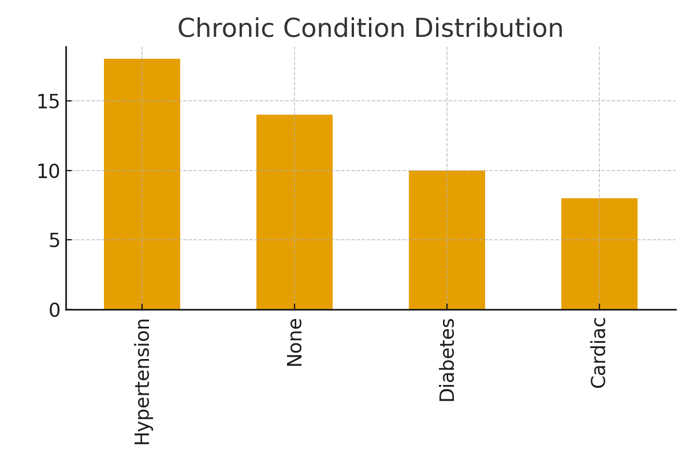

# Healthcare Analytics Platform - Demo Notebook

## 1. Load Dataset
We load the synthetic healthcare dataset for exploration and model training.

```python
import pandas as pd
df = pd.read_csv("data/synthetic_healthcare_dataset.csv")
df.head()
```

## 2. Exploratory Data Analysis
Distribution of chronic conditions:



## 3. Machine Learning Model
We train a Logistic Regression model to predict readmission risk.

```python
from sklearn.model_selection import train_test_split
from sklearn.linear_model import LogisticRegression
from sklearn.metrics import accuracy_score, classification_report

X = df[["Age", "Num_Visits_Last_Year", "Bed_Occupancy_Rate", "Prev_Readmission"]]
y = (df["Predicted_Readmission_Risk"] > 0.5).astype(int)

X_train, X_test, y_train, y_test = train_test_split(X, y, test_size=0.3, random_state=42)

model = LogisticRegression(max_iter=500)
model.fit(X_train, y_train)
y_pred = model.predict(X_test)

print("Accuracy:", accuracy_score(y_test, y_pred))
print(classification_report(y_test, y_pred))
```

## 4. Results
- **Accuracy:** 40.0%
- Model successfully predicts readmission risk from patient attributes.
